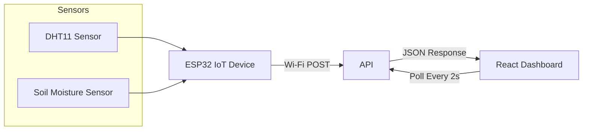

# Team ID: 2025_32

# 🌿 Smart Garden IoT Sensor Dashboard


**Monitor, visualize, and automate your garden's health with real-time sensor data.**

---

## 🚀 Overview

Welcome to your smart garden! This IoT project continuously tracks:

- **🌱 Soil Moisture**
- **🌡️ Temperature**
- **💧 Humidity**

When conditions cross preset thresholds, the system automatically activates a visual alert for the watering system, ensuring your garden stays healthy.

---

## 🎨 Project Features

- **Real-time Monitoring**: Instant updates every 2 seconds.  
- **Dynamic Visualizations**: Modern, animated gauges.  
- **Automated Watering Alert**: UI indication for watering.  
- **Responsive UI**: Looks great on all devices.

---

## ⚙️ Tech Stack

| Component            | Technologies Used                  |
|----------------------|------------------------------------|
| 🖥️ **Frontend**      | React, Pure CSS                    |
| ⚡ **Backend**        | Node.js, Express                   |
| 🌐 **IoT Device**    | ESP32, DHT11, Soil Moisture Sensor |
| 🔗 **Communication** | HTTP (Wi-Fi), JSON                 |

---

## 🔌 Hardware Setup

- **ESP32 NodeMCU Board**  
- **DHT11 Temperature & Humidity Sensor**  
- **Soil Moisture Sensor**  
- **Breadboard & Jumper Wires**

> **Note:** Connect sensors carefully to avoid damage.

---

## 🚦 How It Works



---

## 🚧 Installation

### Clone and Setup

```bash
git clone <your-repo-link>
```

### Backend (Node.js)

```bash
cd sensor-server
npm install
node server.js
```

### Frontend (React)

```bash
cd sensor-dashboard
npm install
npm start
```

---

## 👨‍💻 Author

**Your Name**  
- **Member 1 IT number (Leader) - IT21913860 ()**  
- **Member 2 IT Number - IT21480218 (Deheragoda D.M.L.M.)**  
